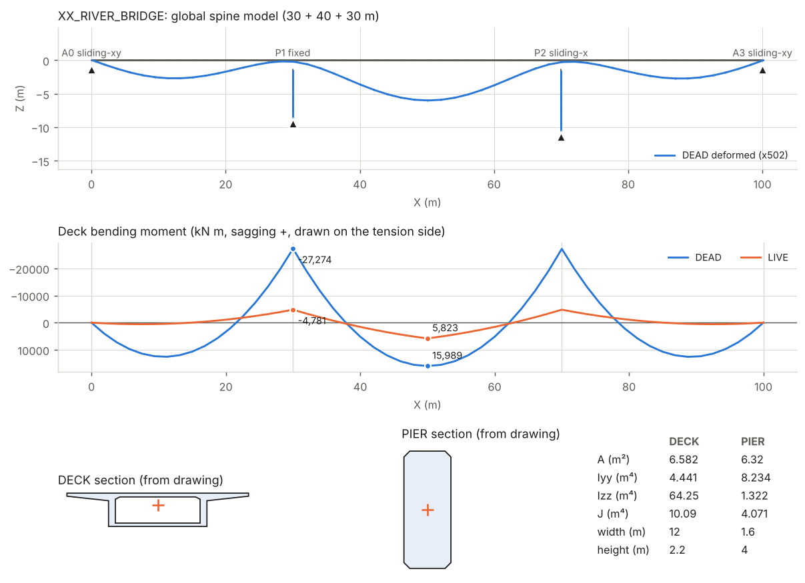

# MultiAgent_CADpdf_FEM

**cad2fem**：一个用 Python 实现的多 Agent 框架，读取 **矢量 CAD 图纸 PDF** 生成 **有限元模型输入文件**。有两种模式：

1. **整桥模式（`cad2fem bridge`）**：读取一套桥梁图纸（总体布置图 + 主梁横断面 + 桥墩断面），把主梁、桥墩、支座拼装成 **一个完整的三维整桥鱼骨梁（spine）模型**，见下文 [整桥模型](#整桥模型cad2fem-bridge)。
2. **构件模式（`cad2fem`）**：单张零件/构件图 → 二维平面应力/应变网格模型。

构件模式输出：

| 格式 | 文件 | 说明 |
|---|---|---|
| Abaqus | `*_abaqus.inp` | CPS3/CPS6（平面应力）或 CPE3/CPE6（平面应变），压力用 `*DSLOAD` |
| CalculiX | `*_ccx.inp` | 同一套关键字格式，压力换算为一致节点力 `*CLOAD`，已用 `ccx 2.21` 实际求解验证 |
| Nastran | `*.bdf` | SOL 101，CTRIA3/CTRIA6 + PSHELL 膜单元，`SPC1`/`FORCE` |
| Gmsh | `*.msh` | MSH 2.2，带边界物理组，可在 Gmsh / ParaView 中查看 |
| JSON | `*_model.json` | 与求解器无关的完整模型（节点、单元、集合、约束、载荷） |

另外输出 `report.md`（含 Agent 日志）和 `mesh.png`（网格 + 校核解的 von Mises 应力云图）。

## 快速开始

```bash
pip install -e ".[dev]"                                   # 或 pip install -r requirements.txt
python examples/make_sample_drawings.py examples/drawings # 生成示例图纸（已附带在仓库中）
python -m cad2fem examples/drawings/plate_with_hole.pdf -o out/plate
python -m cad2fem examples/drawings/l_bracket.pdf -o out/bracket --formats abaqus,nastran
python -m pytest -q
```

常用参数：

```
--mesh-size 4        目标单元尺寸 (mm)，覆盖图纸中的 MESH SIZE
--order 2            二次单元 (Tri6)
--thickness 8        覆盖厚度 (mm)
--plane-strain       平面应变
--outline-width 0.5  轮廓线最小线宽 (pt)，默认自动按线宽聚类
--llm                额外启用 Claude 解读图纸注释（需要 ANTHROPIC_API_KEY）
--prefer llm         规则解析与 LLM 结果冲突时采用 LLM
```

Python API：

```python
from cad2fem import PipelineConfig, run

bb = run("drawing.pdf", "out/", PipelineConfig(element_order=2, use_llm=True))
model = bb["fe_model"]            # 网格 + 集合 + 约束 + 载荷
print(bb["verification"]["max_von_mises_mpa"])
for msg in bb.messages:           # 每个 Agent 的发现、警告和返工请求
    print(msg)
```

## 整桥模型（cad2fem bridge）

```bash
python examples/make_bridge_drawings.py examples/drawings      # 示例图纸集（3 页，已附带）
python -m cad2fem bridge examples/drawings/bridge_3span.pdf -o out/bridge
python -m cad2fem bridge 总体布置图.pdf 主梁断面.pdf 桥墩.pdf -o out/bridge   # 多个文件也可以
python out/bridge/XX_RIVER_BRIDGE_opensees.py                    # 直接用 OpenSees 求解
```



**输入**：每个 PDF 的每一页都是一张"图"，由 Agent 按标题栏自动分类（也可用 `--sheets GENERAL,DECK,PIER` 指定）：

| 图纸 | 读取内容 |
|---|---|
| 总体布置图 GENERAL | 立面图（实测跨径、墩位、墩高、梁高）+ 说明：跨径布置、墩高、支座类型、材料、二期恒载、车道荷载、单元长度 |
| 主梁横断面 DECK | 截面轮廓（含箱室），按比例尺和尺寸标注换算 → A、Iyy、Izz、J、形心高度 |
| 桥墩断面 PIER | 墩身截面 → 截面特性（缺省时假定矩形并告警） |

**整桥模型的组成**（单位 m、kN、kPa；X 顺桥向，Y 横桥向，Z 竖向）：

* 主梁：沿桥轴线的梁单元，位于截面形心高度，每跨偶数个单元（跨中有节点）；
* 桥墩：竖向梁单元，墩底固结；
* 支座：主梁节点 →（刚臂，长度 = 形心到梁底距离）→ 支座顶节点 →（弹簧）→ 墩顶 / 桥台地面节点。
  `FIXED` 固定（约束 X、Y、Z），`SLIDING_X` 纵向活动（约束 Y、Z），`SLIDING_XY` 双向活动（约束 Z）；
  另外都约束绕桥轴的转动，代替实际的一对支座提供抗扭；`MONOLITHIC` 墩梁固结（刚构桥）用刚性连接；
* 荷载工况：`DEAD`（梁、墩自重 + 二期恒载）、`LIVE`（车道均布荷载 qk 满布 + 集中力 Pk 作用在最大跨跨中，乘车道数），
  均换算为一致节点力（含端弯矩），各求解器结果一致。

**输出**：

| 格式 | 文件 | 说明 |
|---|---|---|
| Abaqus | `*_abaqus.inp` | B33 梁 + `*BEAM GENERAL SECTION`、SPRING2 支座、`*MPC BEAM` 刚臂，每个工况一个 perturbation step |
| Nastran | `*.bdf` | CBAR/PBAR、CELAS2、RBE2，每个工况一个 SUBCASE |
| OpenSees | `*_opensees.py` | 可直接运行的 OpenSeesPy 脚本，求解所有工况，结果写入 JSON |
| JSON | `*_model.json` | 求解器无关的完整模型 |
| 报告 | `report.md`、`bridge.png` | 跨径/截面/支座汇总、各跨挠度、支反力、主梁弯矩图 |

**Agent 团队**：`SheetReader` → `SheetClassifier` → `Elevation`（立面实测）/ `Section`（截面特性）/ `LLMLayout`（可选）→ `Layout`（说明与立面实测互相校核）→ `Assembly` → `BridgeValidator`（单元密度不足时请求 `Assembly` 加密）→ `BridgeVerifier`（内置三维框架求解器）→ `Writer` → `Report`。

**交叉校核**（体现多 Agent 的意义）：
* 说明中的跨径、墩高 vs 立面图实测值（不一致告警；说明缺失时直接用实测值）；
* 立面图比例 vs 尺寸标注（如 `3000`、`4000`、`10000` cm）；
* 横断面图梁高 vs 立面图梁高；
* 支座布置是否构成机构（无纵向固定支座、横向约束不足）；求解时奇异刚度会被识别并报错。

**验证**（`tests/test_bridge.py`，共 13 项）：
* 示例三跨 30+40+30 m 连续箱梁：从图纸识别出的跨径、墩高、截面尺寸与绘制值一致；箱梁面积与手算 6.582 m² 一致；
* 恒载中支点负弯矩与三弯矩方程（Clapeyron）解相差 < 1%；两跨连续梁的支反力、跨中/支点弯矩与理论解相差 < 0.5%；
* 墩顶受水平力的悬臂位移与 PH³/3EI 一致（两个方向分别校核截面主轴方向）；
* 生成的 OpenSees 脚本实际运行，各工况位移与内置求解器一致（差值 < 1e-10 m）；
* 扭转常数：圆截面误差 < 0.5%，矩形与级数公式相差 < 1%。

## 架构：黑板 + 数据驱动调度

```
                         ┌──────────────── Blackboard（共享产物 + 消息）────────────────┐
 pdf_path ──► PDFParser ──► drawing ──┬─► Annotation (规则) ──► spec_rules ─┐
                                      ├─► LLMAnnotation (Claude, 可选) ─► spec_llm ─┼─► Spec ──► spec
                                      └─► Geometry ──► part_pt ──────────────────────┘     │
                                                         └──► Dimension (比例尺校准) ◄─────┘
                                                                   │ geometry (mm)
                                                                   ▼
                                    ┌──────────── REQUEST: refine ────────────┐
                                    ▼                                         │
                                  Mesh ──► mesh ──► Boundary ──► fe_model ──► Validator ──► validation
                                                                                   │
                                                  Verifier (内置 CST 求解) ◄────────┤
                                                  Writer ──► outputs ──► Report ◄──┘
```

* **Agent 之间不直接调用**：每个 Agent 声明 `requires` / `optional` / `provides`，只通过黑板读写产物、发送消息。
* **Orchestrator** 按数据可用性调度：某 Agent 所需的键都在黑板上、且其输入版本发生变化（或收到改变其参数的 REQUEST）时才运行，下游自动重算。
* **反馈回路**：`ValidatorAgent` 发现网格问题（小角度单元、边界不贴合、孔周分辨率不足、面积误差）时向 `MeshAgent` 发 REQUEST 加密网格（默认最多 2 次），Boundary/Validator 自动重跑，通过后才放行 Writer。

| Agent | 职责 |
|---|---|
| `PDFParserAgent` | pdfplumber 读取线段/矩形/曲线路径（Bézier 离散化），识别整圆（用锚点精确拟合圆心、半径），提取文字并按行合并；旋转 90° 的尺寸文字按 CAD 习惯从下往上读 |
| `AnnotationAgent` | 规则解析标题栏与技术要求：比例、单位、材料（内置材料库）、E/ν、厚度、平面应力/应变、网格尺寸、单元阶次、边界条件、载荷（支持中英文） |
| `LLMAnnotationAgent` | 可选。调用 Claude（`claude-opus-5-5`，结构化输出 + Pydantic schema）理解自由文本注释；无凭据/网络错误/拒答时自动降级为规则结果 |
| `SpecAgent` | 合并规则、LLM、命令行覆盖值；冲突时给出警告 |
| `GeometryAgent` | 按线宽区分轮廓线与尺寸/中心线，线段求交打断、构建平面图，取各连通分量外边界；剔除图框和标题栏；最大闭合环为零件，内部环为孔 |
| `DimensionAgent` | 用尺寸数字（`200`、`Ø40`、`R10`、`2x Ø12`）与实测长度匹配做比例尺校准，并与标题栏比例互相印证；不一致时以多数尺寸为准并告警 |
| `MeshAgent` | 边界按尺寸重采样（保留角点）+ 正三角形点阵 + Delaunay + Laplace 光顺；小孔周围生成渐变同心环加密；可升阶为 Tri6（孔边中节点投影到圆上） |
| `BoundaryAgent` | 把 `LEFT/RIGHT/TOP/BOTTOM/HOLE<n>/HOLES/X=<v>/Y=<v>` 映射为节点集与单元面；压力和集中力换算为一致节点力 |
| `ValidatorAgent` | 单元方向、最小角、边界贴合、孔周分辨率、面积误差、刚体位移约束秩检验、载荷检查；必要时请求返工 |
| `VerifierAgent` | 内置 CST 线弹性求解器做冒烟测试：平衡误差、最大位移、von Mises |
| `WriterAgent` / `ReportAgent` | 写出各格式文件与报告 |

## 图纸约定（规则解析器能识别的写法）

* 必须是 **矢量 PDF**（CAD 直接导出）。扫描件需先矢量化。
* 可见轮廓线用粗线，尺寸线/中心线用细线或虚线（标准制图习惯，自动识别线宽分界）。
* 坐标原点为零件包围盒左下角，单位 mm / N / MPa。
* 孔编号 `HOLE1, HOLE2, …`：按圆心 x 从小到大，再按 y。
* 注释示例：

```
TITLE  L_BRACKET            MATERIAL  ALUMINIUM 6061-T6      THICKNESS  8 mm      SCALE 1:1
1. FIXED: LEFT EDGE                     (也支持 PINNED / ROLLER / SYMMETRY / UX=0)
2. LOAD: TENSION 50 MPa ON RIGHT EDGE   (TENSION/TRACTION 为拉，PRESSURE 为压入表面)
3. FORCE 2 kN -Y ON HOLE 2              (合力，均布到所选边界)
4. MESH SIZE 5; ELEMENT: TRI6; PLANE STRAIN; E = 200 GPa, NU = 0.28
固定: 左边    拉力 30 MPa 作用于 右边    材料: Q355    厚度: 12
```

## 扩展

新增 Agent 只需继承 `Agent` 并声明输入输出，调度器会自动把它接入流程：

```python
from cad2fem.core import Agent
from cad2fem.pipeline import PipelineConfig, build_agents, run

class HoleCountCheck(Agent):
    name = "hole_check"
    requires = ("geometry",)
    provides = ("hole_check",)

    def run(self, bb):
        if len(bb["geometry"].holes) != 2:
            self.warn(bb, "expected 2 holes")
        bb.post("hole_check", True, self.name)

agents = build_agents(PipelineConfig()) + [HoleCountCheck()]
run("drawing.pdf", "out/", agents=agents)
```

适合继续扩展的方向：多视图/多零件、基于 gmsh 的网格 Agent、三维拉伸（C3D 单元）、扫描件的视觉 Agent（把页面图像交给 Claude 识别）、接触/多载荷步。

## 验证

构件模式（`tests/` 中其余 22 个测试，全部共 35 个）覆盖：注释解析（中英文）、几何识别（圆孔半径、圆角面积）、比例尺冲突处理、反馈回路、LLM Agent（mock 客户端）、各格式写出，以及：

* 无孔板受拉：端部位移与解析解 σL/E 误差 < 2%，远场应力 50 MPa 误差 < 1%；
* 生成的 CalculiX 文件经 `ccx` 实际求解，支反力 −50 kN 与施加载荷平衡；三个示例中内置 CST 校核解与 CalculiX 的最大位移一致（0.0474 / 0.0581 mm，支架 Tri6 3.13 mm vs CST 2.99 mm）。

## 局限

整桥模式：
* 单根主梁鱼骨模型（直线桥、无斜交/曲线），全桥等截面（变高度梁需扩展为分段截面）；
* 墩底固结，未考虑桩土相互作用；支座用刚度弹簧模拟；
* 活载为满布车道荷载 + 一个集中力，不是影响线最不利加载包络；未考虑预应力、施工阶段、收缩徐变；
* Abaqus / Nastran 文件按格式规范生成，但本环境中没有这两个求解器，未实际运行验证（OpenSees 已验证）。

构件模式：

* 二维平面问题（平面应力 / 平面应变），单零件、单视图（多视图时取最大的闭合轮廓并告警）。
* 规则解析依赖常见的注释写法；措辞自由的图纸建议加 `--llm`。
* 内置网格器面向板件/支架类零件；复杂几何建议接入 gmsh。
